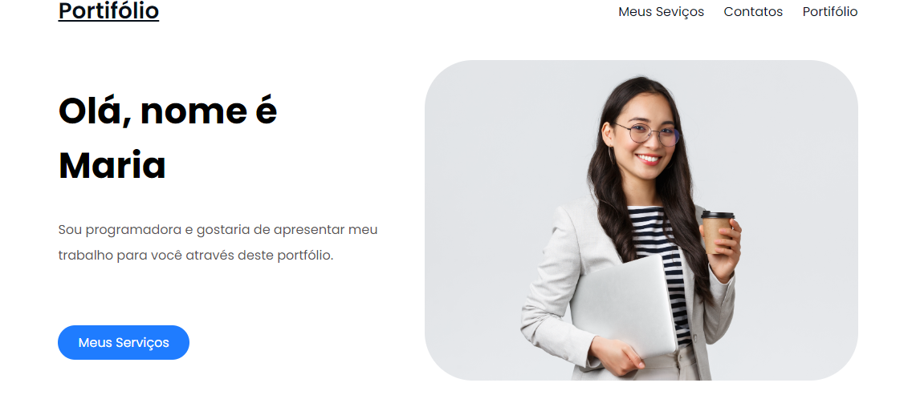

<p align="center">
    
</p>
<p align="center">Preview Landing Page Portifólio</p>

# LandingPage - Portifólio
>i **NOTE:** Repositório desenvolvida com base na aula pratica de `Da tela ao site` da [EscolaDNC](https://aluno.dnc.group/painel)

## Descrição
Este é um portifólio fictício onde é apresentado os projetos desenvolvido por uma programadora cujo seu nome é `Maria`. A ideia é ter um espaço para mostrar os trabalhos e evoluções ao longo da área de tecnologia. 

## Para que Serve?
A ideia inicial desse projeto, é ter como base esse portifólio que servirá como uma vitrine online para que recrutadores, colegas de profissão e qualquer outra pessoa interessada possam conhecer meu trabalho e minhas competências. Ele funciona como uma extensão do meu currículo, com a vantagem de poder ser atualizado com novos projetos e experiências a qualquer momento.

## Demostração
Para visualizar a Landing-Page do portifólio, acesse [Portifólio de Projetos](https://luizvictorino.github.io/portfolio/) ou clone o repositório para seu ambiente local:

```
git clone https://github.com/luizvictorino/portifolio.git
```

Navegue até o diretório do projeto:
```
cd portifolio
```

Abra o arquivo index.html no seu navegador preferido.


## Tecnologias Utilizadas
As tecnologias utilizadas neste projeto foram;
* **`HTML:`** para a estruturar o conteúdo da página.
* **`CSS:`** para estilizar e dar vida ao layout do portifólio.

## Estrutura de Pastas
Aqui está uma visão geral da estrutura do projeto:

    portifolio/
    ├── img/            # Imagens utilizadas no site
    ├── index.html      # Página principal do portfólio
    ├── style.css       # Arquivos de estilo (CSS)

## Melhorias Futuras
* **Design Responsivo:** Implementar um design que se adapte a diferentes tamanhos de tela, garantindo uma boa experiência em dispositivos móveis e desktops.
* **Arquivo JavaScript:** Implementar funcionalidades de interação.

## Uso
* Edite o conteúdo do arquivo `index.html` para personalizar os textos e imagens da landing page.
* Adicione suas próprias folhas de estilo `style.css` para modificar o design conforme necessário.

## Contribuições
Se você tiver alguma ideia de melhoria ou quiser colaborar de alguma forma, sinta-se à vontade para abrir uma issue ou fazer um pull request. Toda ajuda é bem-vinda!

## Especialista
<p>
    
    <p>&nbsp&nbsp&nbspLuiz Victorino<br>
    &nbsp&nbsp&nbsp
    <a href="https://github.com/luizvictorino">
    GitHub</a>&nbsp;|&nbsp;
    <a href="https://www.linkedin.com/in/luiz-victorino/">LinkedIn</a>
&nbsp;|&nbsp;
</p>
